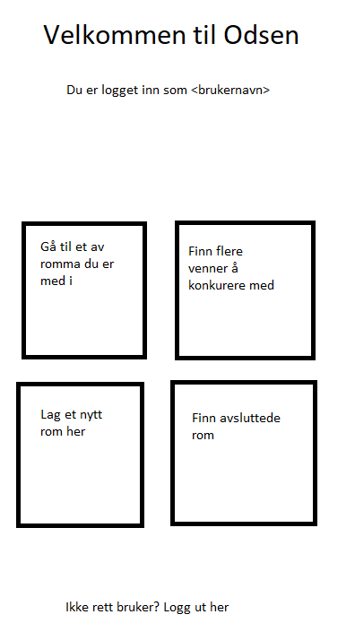
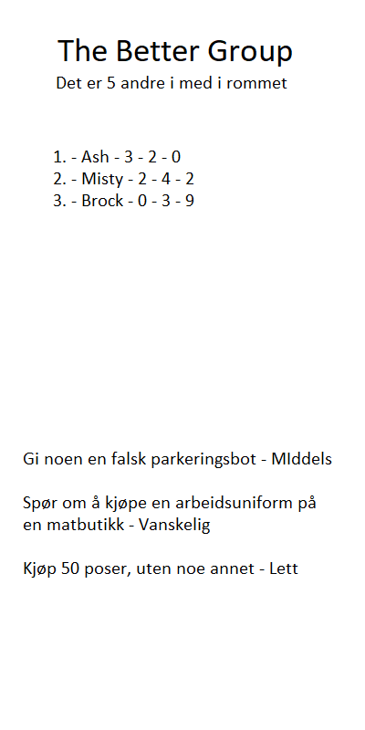
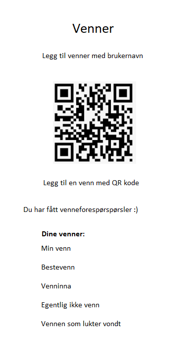
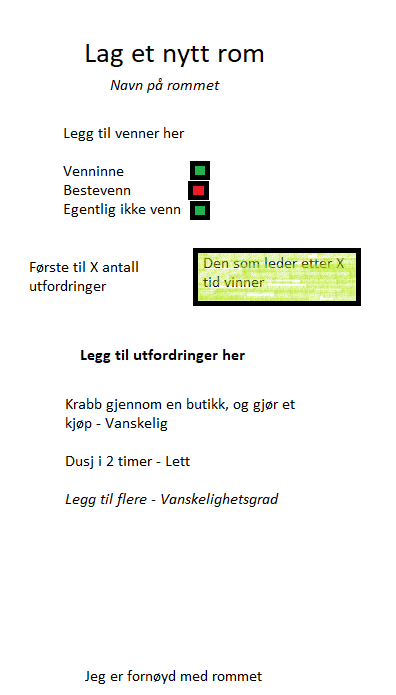
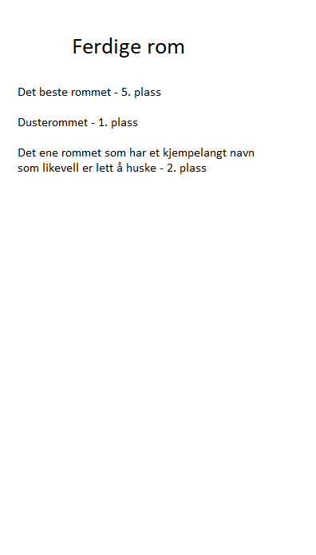

# Odsen

## Innhold
1. [Intro](#intro)
2. [Plan før start](#plan-før-start)
3. [Endringer](#endringer-fra-utgangspunktet)
4. [Bruk](#brukerveiledning)
5. [Design](#design)
6. [Krav](#krav)
7. [Systemdesign](#systemdesign)
8. [Brukervurderinger](#tilbakemeldinger)
9. [Gjennomføring og problemer](#utfordringer)
10. [Totalvurdering](#totalvurdering)

## Intro
### Beskrivelse
Denne appen er ment for å grupper av folk. Det vil fungere som et spill man spiller seg imellom. Tanken er at man lager "rom" med de man vil spille med. Deretter lager man utfordriger til hverande, som blir fordelt avhengig av modus man velger. Når man bruker appen blir det dermed ikke appen som er i fokuset likevell, ettersom det heller blir en slags "lek".

### Hvorfor?
Tanken med appen er at den kan brukes i en vennegruppe, for eksempel på fest eller "bli kjent" leiker. Det er derfor viktig med en app som er lett å bruke, og enkel å komme i gang med.

Appen er tenkt for å lett holde oversikt over hvem som har gjort hva. Det er i utgangspunktet lite funksjonalitet i appen, ettersom bruken av den bare er en oversikt som oppdateres.

## Plan før start
### Set mode
I denne modusen er tanken at man får et sett med utfordringer, og den som først fullfører alle vinner. Hvis man er 5 stykker, lager man da 4 utfordringer i stigende vanseklighetsgrad. Deretter blir det fordelt tilfeldig på de andre, så alle vil ende opp med 4 utfordringer. Dersom man vil ha flere utfordringer med en gang kan man lage flere serier med utfordringer.

#### Loose mode
Her blir alle utfrodringene tilgjengelig for alle, og det er førsteman til mølla med å fulføre de. Dersom en har fullført en utfordring vil ikke de andre kunne fullføre den. I tillegg kan man ikke fullføre sine egne utforminger. Hver utfordring vil da han en score avhengig av hvor vanskelig den er. Den med høyest score vil da vinne når man er ferdig.

### Validering av utfordringer
For å få en utfordring godkjent kan man enten velge om man stoler på hverandre, altså at man ikke har noen form for validering. Dette passer best for utfordringer som påvirker noen i gruppa, så noen på den måten ser det.

Alternativt kan man ha en intern validering. Da kan man for eksempel tar bilde av at man har fullført en utfordring, eller en annen kan være med og se på utfordringen bli fullført. For eksempel å skrive noe med tusj i ansiktet og gå på butikken kan man ta bilde av, mens å løpe naken over en bruk kan man få noen med på å se på.

## Endringer fra utgangspunktet
Istedenfor å velge mellom "set" og "loose" blir alle utfordringer i et rom tilgjengelig for alle spillere. I tillegg er det heller ikke mulighet til å velge en vanskelighetsgrad på utfordringer. Det gjør at det er mindre å trykke på i appen, som gjør det lettere å komme igang, samt at alle som spiller har like forutsetninger for å spille.

Det er i tillegg heller ikke validering av utfordringer med i sluttappen. Grunnen til dette er at det for meg virker unødvendig, siden man spiller med andre man kjenner. Når man spiller med personer man kjenner skal det mer til for å jukse enn om man hadde spilt med ukjente. I tillegg vil man kunne oppdage ganske lett om noen jukser, som igjen er med på å håndtere problemet.

I tillegg hadde det blitt noe man måtte brukt tid på når man bruker appen, som tar fokuset bort fra spillet. For denne appen er litt av poenget å bruke så lite tid som mulig på appen, ettersom appen i seg selv bare "støtter" en annen "lek".

## Brukerveiledning
1. Logg inn eller registrer deg når appen åpnes første gang
   * Etter å ha logget inn er du allerede innlogget neste gang
2. Gå til "Finn flere venner å konkurere med"
3. Legg til venner
	* Må da ha minst en annen venn å spille med
4. Gå tilbake til hovedskjermen, og så "Lag et nytt rom å spille i"
5. Fyll ut feltene, og legg inn flere utfordringer
6. Gå til "Gå til et åpent rom du er med i", og velg det nye rommet fra lista
7. Gjør utfordringer, og marker dem som fullført
   * Legg eventuelt til flere utfordringer dersom det starter å gå tomt
   * Avslutt rommet når dere er lei eller det ikke er flere utfordringer

## Design
De fleste bruker mobiler i portrett modus fremfor landskapsmodus, spessielt når man ikke bruker den lenge. 

Dette er forsiden man kommer til, dersom man er logget inn. Her får man vite hvem man er logget inn som, og 4 ulike bokser man bruker til å gå videre. I tillegg er det en mulighet til å logge av fra enheten. Dette skiller seg fra "vanlig" navigering for android, men er mer naturlig i spill.

Siden brukere må innom denne siden hver gang man skal inn på en av de andre sidene vil også dette fungere som en meny. Etter at man har gått inn på en av sidene kan man da komme tilbake hit ved tilbakeknappen man har på enheten sin.

Kommer hit etter å ha valgt et rom fra forsiden. Navnet på rommet kommer øverst, og så antallet i rommet. Antallet kan man klikke på for å se en liste med navnene. Deretter kommer en liste med de som leder i et rom, sammen med antall utfordringer vedkommende har fullført. Til slutt er det en liste over gjennværende utfordringer.

Siden har øverst en mulighet for å legge til andre brukere som venner, via brukernavn. I tillegg kommer en QR kode som kan brukes av noen andre for å kunne legge deg til som venn. Nederst er det en liste over alle vennene du har i appen.

I tillegg er det en linje der det står at man har fått venneforespørsler, dersom man har fått det. Da får man opp en oversikt over alle forespørsler man ikke har bekreftet/avvist i kronologisk rekkefølge.

Via denne skjermen kan man opprette nye rom. Fra øverst til nederst starter man med å velge navn på rommet. Deretter velger man hvem som skal være med i rommet, enten via søk eller via å krysse av fra en liste med de man spiller mest med. Etter det velger man når rommet avsluttes, markert med grønn boks. Man må i tillegg oppdatere "X" til enten et tall eller en dato.

Man må også legge til utfordringer til rommet, og sette en vanskelighetsgrad på dem. Brukeren legger da inn en tekst til å beskrive utfordringen, og velger mellom "Lett", "Middels" og "Vanskelig". Vanskelighetsgraden på utfordringer i en gruppe vil justere seg innad i gruppen etterhvert som deltakerne merker hva de synes er lett og vanskelig. Når man er ferdig har man en knapp til det nederst.

For alle tidligere fullførte rom er tanken at man skal kunne se hvor bra eller dårlig man har gjort det sammenlignet med de andre i rommet. Derfor har man en samleside for alle tidligere rom, der man kan scrolle gjennom en liste der navnet på rommet og din rangering står. Derfra kan man velge et for å se hvem som har gjort hvilke utfordringer, og den samlede resultatlista.

### Lyd og bilder
For at appen skal fungere vil det ikke være behov for noen bilder eller lyder. Det kan derimot være med på å gjøre appen mer brukervennlig ved at den skiller seg ut. For eksempel vil det være lettere å finne appen med et eget ikon blant alle andre apper. I tillegg vil en egen lyd gjøre det lettere å kjenne igjen varsler ved at de skiller seg ut fra andre varsler.

## Krav
For at appen skal kunne brukes så er det visse ting som må fungere, mens andre ting er mindre viktig. Siden ikke alle krav er like viktige er det derfor noen ting man må prioritere mer en andre. Derfor lager jeg 3 lister med krav ettersom hvor viktige de er.

### Må
Det er krav som må være på plass for at appen i det hele tatt skal fungere. Uten disse kravene vil appen ikke fungere. Jo flere av disse kravene som blir fullført, jo mer av appen vil fungere.

* Kommunikasjon med server / andre enheter
* Lage et rom
  * Gi tilgang til andre brukere til rommet
* Vise utfordringer som er i et rom man er med i selv
* Registrere en utfordring som fullført
* Se hvem andre som er med i et rom
* Se hvem som har fullført hvor mange utfordringer

### Bør
Her er krevene som ikke er viktige for kjernefunksjonaliteten, men som tilbyr funksjonalitet likevell.

* Legge til utfordringer etter et rom er opprettet
* Se hvem som leder i et rom
* Kunne bytte mellom flere rom
* Avslutte et rom når man er ferdige
  * Se et rom som er avsluttet, både resultater og utfordringer
* Logge inn

### Kan
Kravene som er i denne kategorien er krav som ikke kommer til å bli prioritert i første omgang. Dette er fordi de ikke gir noen stor nytteverdi til appen.

* Verifisering av utfordringer
* Få varsel når noen fullfører en utfordring
* Få varsel når et rom avsluttes

### Ikke-funksjonelle krav
I tillegg er det enkelte krav som ikke har noe med selve appen å gjøre. Disse kravene er viktige for at appen skal fungere, selv om de ikke er like direkte knyttet til appen som de andre kravene.

* Database
  * Google Firestore Database
  * Google Authentication
* Mørkt tema for brukervennlighet
* Universell utforming

## Systemdesign

### Service og fragment
Tanken med appen er at den skal brukes aktivt i kortere perioder. Derfor vil det meste av appen ikke trenger å kjøre i bakgrunnen når appen lukkes. I tillegg er appen frittstående, som igjen gjør at den ikke trenger å kommunisere med andre apper. Derfor vil det for det meste av appen kun være en Activety.

Appen skal kunne gi varsler for når andre har fullført en utfordring og når rom avsluttes. Derfor må appen ha en kobling mo backend når appen er lukket for å sjekke etter varsler brukeren skal få. Til dette trengs det en Service. Alternativt kunne man brukt et Fragment, men Service vil kunne overleve bedre som en bakgrunnsprosess.

### Lagring av data
Appen vil inneholde både data om rom og om brukeren. Det meste av dataen skal i tillegg deles med andre brukere, som nødvendigvis ikke er i nærheten. Derfor vil man måtte ha data eksternt. Til dette tenker jeg å bruke firebase, ettersom det ser ganske greit ut å koble sammen. I tillegg vil firebase også kunne brukes til brukerhåndtering.

### Brukerhåndtering
Siden en bruker skal kunne bruke appen på flere enheter som samme bruker, vil man måtte ha brukerhåndtering. I tillegg til at det er flere brukere som konkurerer mot hverandre i et rom vil det også være nødvendig med brukerhåndtering for å kunne skille de ulike brukerne fra hverandre.

### Hovedkomponenter
Hvert skjermbilde vil være en egen komponent, med tillhørende funksjonalitet. Det vil si at det er behov for 5 skjermer i appen, samt 2 for listing av rom. I tillegg må brukeren være logget inn for å bruke appen, som vil si at det  må være en innloggingsside.

Utenom brukerhåndtering bør alle krav kunne dekkes av de andre skjermene. Appen blir da forholdsvis liten ettersom det bare er 4 skjermer å legge innhold på, siden den første skjermen i praksis bare er til navigasjon.

#### Klasser
Hver skjerm trenger sin egen klasse for å tilby funksjonalitet til skjermene. I tillegg trengs det egne modell klasser i appen, for eksemple for utfordringer og brukere. Dette er for å samle data og funksjonalitet som hører sammen.

Det var også tenkt å ha en egen klasse for alt som har med database å gjøre. Det var igjen for å samle logikk, og for å gjøre det lettere å bytte til en annen database. Databaselogikken ble likevell spredd rundt i de ulike klassene der det ble brukt, ettersom det gir noe mer funksjonalitet.

Utover dette er det 2 klasser til, DBTags og LogTags. Dette er klasser med konstanter som brukes for å unngå skrivefeil og for å holde orden på hva de ulike taggene som brukes er.

## Tilbakemeldinger
Her er tilbakemeldinger fra brukere av appen samlet. Ettersom appen ikke har vært ferdigutviklet har det dermed vært noe funksjonalitet som ikke har vært med, og dermed ikke blitt sett på.

### Oslo 12 - 14 novmeber
#### Brukere
Var på en helgetur til Oslo med 2 venner, så vi var altså 3 som brukte appen. I tillegg hadde vi allerede en del planer for helga, så det var dermed litt lite tid til å holde på med appen. Likevell blei det litt tid til appen, og det er dermed noen tilbakemeldinger under.

#### Tilbakemeldinger
 * Bugs
   * Rom blei ikke vist etter at de blei opprettet. 
     * Dette var fordi det nylig blei lagt til en sjekk mot et felt i databasen når rom lastes. Det feltet blei ikke laget når man opprettet rom.
   * Vanskelig å se med mørkt tema.
     * Under utviklingen har det blitt brukt en emulator med lyst tema. Det har derfor ikke blitt tenkt på at brukere kan ha mørkt tema. Hvis man skrudde opp lysstyrken løste det problemet.
   * Lista med utfordringer oppdateres ikke når man oppretter rom
 * Navigering
   * Lett å navigere, likte at det var få skjermer
     * Ville ikke ha en egen navigasjon bar, ettersom det blir 'overkill' når appen er så liten.
   * Ha en egen tilbakeknapp
     * Ettersom ikke alle mobiler har en egen tilbakeknapp, uten å swipe opp bunnen.
   * Bytte plass på forsiden for "Finn venner" og "Lag nytt rom"
     * Gjør "Lag nytt rom" mer tilgjengelig, som bør være en funksjon man bruker oftere
 * Design
   * Tilpasse appen til mørkt tema.
     * Gjør appen mer brukervennlig, og den blir ganske vanskelig å bruke sånn den er nå.
   * Eget ikon for appen, så man har noe å forbinde den med
     * Vanskelig å huske hvilket ikon som hører til appen, da den ikke har noen tilknytting.
   * Burde kunne legge til utfordringer i et aktivt rom
     * Gjør at flere brukere kan legge til utfordringer
     * Slipper å legge til mange utfordringer på en gang mens man lager et rom
 * Totalinntrykk
   * Lett å bruke
     * Sett bort ifra at jeg manuelt i databasen måtte legge til felt. Burde endre litt på hint felt, ettersom de kan være litt utydelige
   * Lett å komme igang
     * Tar veldig kort tid å kunne starte å spille, så det er en lav terskel for å prøve appen
   * Gøy for små "events"
     * Passer til små grupper, og for et kort tidsrom. Eksepelvis "bli kjent" leiker og utdrikkningslag

## Gjennomføring
### Ting som gikk bra
Målet med appen passer bra med slutt resultatet føler jeg. Grunnen til at jeg mener dette er at appen er veldig lett å bruke og lett å komme i gang med. Gjennom hele planleggingen har det også vært det viktigste temaet. I tillegg føler jeg at selve planleggingen gikk veldig bra, og at appen virker som planen tilsier.

### Problemer
#### Tekniske problemer
Hadde en del problemer med å legge til Firebase. Grunnen til dette var at keystore ikke fungerte fordi Java ikke var installert rett. Det ga noen kryptiske feilmeldinger, men fungerte etterhvert. Utover det har det ikke vært noen store nevneverdige problemer.

#### Andre ting som tar tid
Nå utover høsten har det vært ganske strengt med når barn blir sendt hjem fra barnehager. Ettersom jeg har en unge som har vært mye forkjøla har det gått utover tid som kan brukes på skole.

I tillegg har det vært en gruppeeksamen på 4 uker, der halvparten av gruppa ikke gjorde noe. Det blei derfor mye mer å gjøre i det faget nå på slutten av semesteret. I tillegg var det 3. faget jeg hadde veldig mye større en forventet. Det blei dermed ganske begrenset med tid til faget, noe appen dessverre bærer preg av.

### Forbedringer
#### Ikke ferdig
Det mest åpenbare som ikke er ferdig er "FinishedRooms". Det som skulle vært der er først en liste tilsvarende på OpenRoomsList, og ha mulighet til å velge et for å se detaljer om hvem som vant, utfordringer og så videre.

I tillegg skal det være filtrering på både avlsuttede og aktive rom, ettersom det potensielt kan bli lange lister. Dette har heller ikke blitt implementert, så det er heller ikke ferdig.

Det er heller ikke satt opp notifications, som planen i utgangspunktet var. Planen var at man skulle få varsler når noen fullfører en utfordring i et rom man er med i og når man blir lagt til i et rom. Det kan bli mange varsler etterhvert, så det bør i tillegg da være mulighet til å skru av varsler.

#### Testing
Det skulle med fordel ha vært tester for appen. Under utviklingen har jeg manuelt sjekket at alt fungerer, og det har gått greit ettersom appen er så kompakt som den er. Derimot skulle det vært automatiserte tester for å slippe å gjøre det manuelt. I tillegg vil det bli mer å sjekke etterhvert som appen hadde blitt større, så manuel testing blir mer omfattende etterhvert.

#### Gjort annerledes
OpenRooms, og FinnishedRooms, burde har vært Fragments istendenfor Activety. I tillegg burde det vært bestemt fra starten av hvordan dataobjektene i databasen skulle være.

I tillegg burde jeg heller ha brukt noe mer tilpasset for lister enn LinearLayout med TextView. Det har fungert, men kunne vært mer optimalisert. I tillegg hadde det bare vært å finne ut hvordan man gjør en gang, og så gjøre det samme alle stedene det blir brukt.

#### Prosess
Under utviklingen har de fleste oppgave blitt gjort. De har på den måten fungert som prototyper for prosjektet. I tillegg har de fleste deler av appen blitt gjort så små som mulig, og dermed har det vært lite behov for ytterligere prototyping.

## Totalvurdering
Totalt for appen føler jeg at tanken var ganske bra, men at gjennomføringen kunne ha vært bedre. Det ser man også på dokumentasjonen, ettersom dokumentasjonen har fokus på de sammen tingene for appen hele veien, og ikke tar opp nye funksjoner underveis.

I motsettning til dokumentasjonen føler jeg selv at appen ikke har blitt like bra. Mye av dette er fordi appen har forholdsvis lite funksjonalitet, og likevell ikke blitt ferdig. Likevell føler jeg at det som har blitt gjort i appen er gjort på en grei måte, så det som er gjort føler jeg er gjort bra.