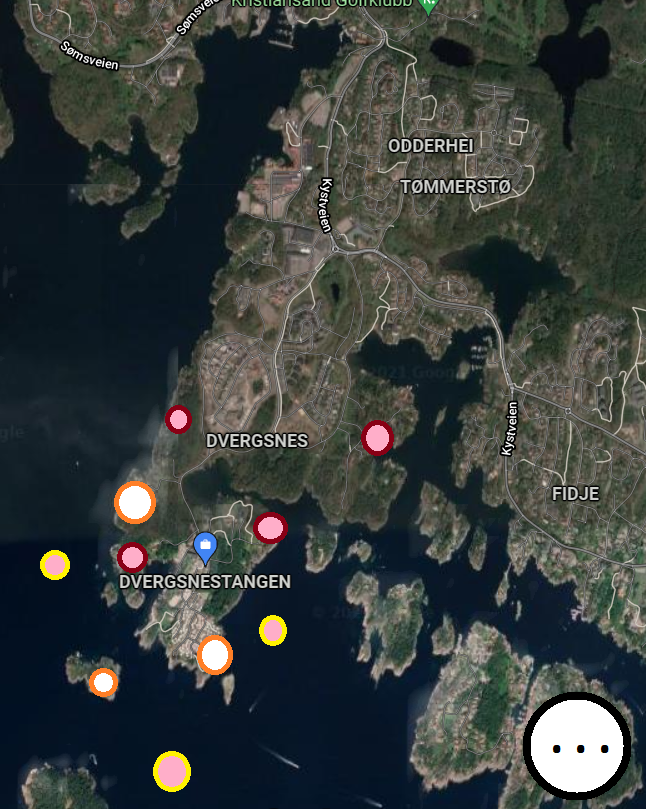

# Wildlife

## Beskrivelse
En app som kobles opp med mot databaser med GPS koordinater og koordinater fra mobilen. Dermed kan man mobiler si ifra når den er i nærheten av noe "spennende". Dette kan i teorien kobles opp mot hvilken som helst type database, men tanken er å koble dette mot dyre- og planteobservasjoner.

Dette er for å kunne varlse brukere når de er i nærheten av noe de selv har sagt at de er interessert i, for eksempel fluesopp og rådyr.

I tillegg appen eventuelt ha en oversikt over hva man har sett, og hva som kan være tilsvarende.

## Design

Et kart med oversikt over steder der ting har blitt observert. For eksempel kan gulmed rosa markere seler, rød med rosa kan være sopp av diverse slag og orange med hvit kan være kaniner.

I tillegg har man tilgang til en meny til høyre der man kan filtrere hva som vises på kartet. I tillegg kan man derfra kunne søke opp en ting for å derfra kunne finne et sted man vil reise.

## Pros n cons

### Pros
En del android ting som kan brukes, som push varsler for ting som oppdateres i nærheten. I tillegg til kart tjenester på telefonen for å kunne finne for eksempel en plante, og bruke navigasjonen på enheten.

### Cons
Er avhengig av å ha en database/server som appen kan oppdaters fra. Siden dette er en app som bare brukes på en enhet, i motsettning til Odsen, kan dette fakes og jukses med. I tilfellet vil det bare fungere med forhåndsregistrerte ting, uten å kunne oppdatere det.