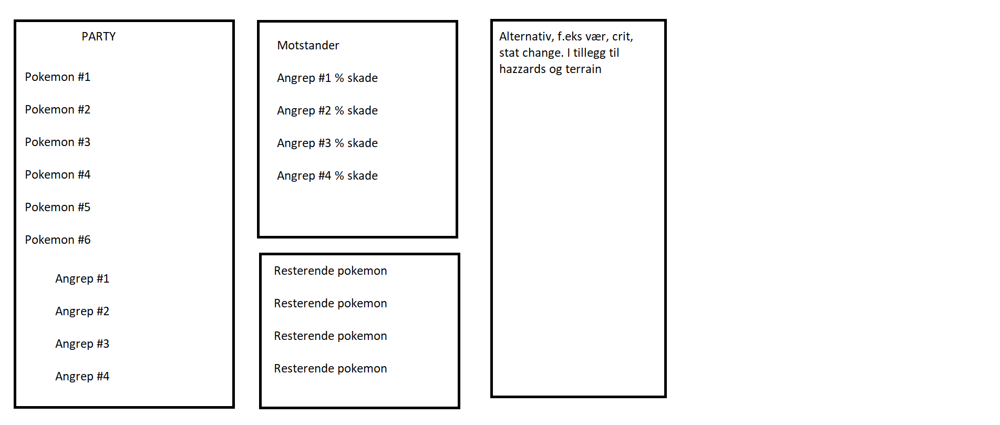
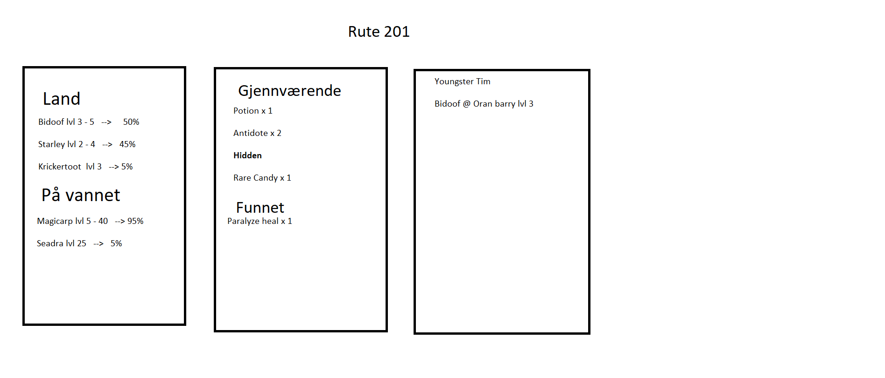

# Pokémon hjelp

## Beskrivelse
En app for å hjelpe med å holde oversikten mens man spiller pokemon. Primert er tanken at man spiller pokemon(på en annen platform), mens man da kan støtte seg mot mobilen. For eksempel med kart, oversikt over hvor diverse items er, hvilke encounter som er på hvilke ruter og oversikt over trener man kan møte på.

Kort fortalt en mobilapp versjon av for eksmempel [denne boka](https://www.ebay.co.uk/b/pokemon-strategy-guide/bn_7024871881). I tillegg til at den da kan ha søk etter items eller ulike pokemon.

Hovedforskjellen mellom boka og appen er at appen kan ha en "damage calculator" for å beregne hvor mye skade man både får og kan gi, på en lett måte. Siden appen også veit hvilke pokemon man selv har kan dette gjøres automatisk, for å lettere får oversikt. Dette er noe som "proffe" gjør med andre eksterne verktøy".

## Design

Boksene i bildene er for å vise at det er forskjellige seksjoner, de er ikke tenkt for å være med i designet. I tillegg er tanken at det skal være en bakrgrunn tilpasset innholdet. For ruten kan det være et kart over selve ruten, for å gjøre det mulig å navigere seg gjennom (for eksempel i mørke grotter, som Dark Cave eller Victory League).

## Pros n cons
### Pros
Pokemon er gøy, og jeg kommer derfor til å syns det er mer gøy  holde på med under utvikling. I tillegg er dette noe jeg har savnet mens jeg har spilt i min oppvekst.

### Cons
Er ikke alt for mye spesielt android spesefikt man kan dra inn. Blir i hovedsak are et enkelt program man plotter inn data i underveis.