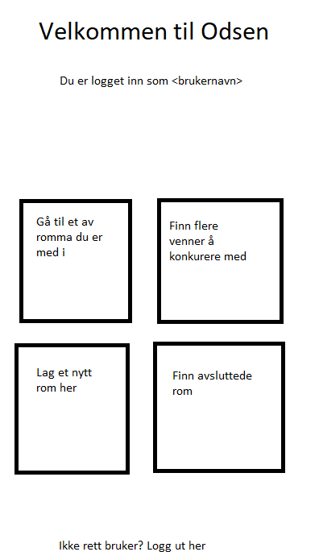
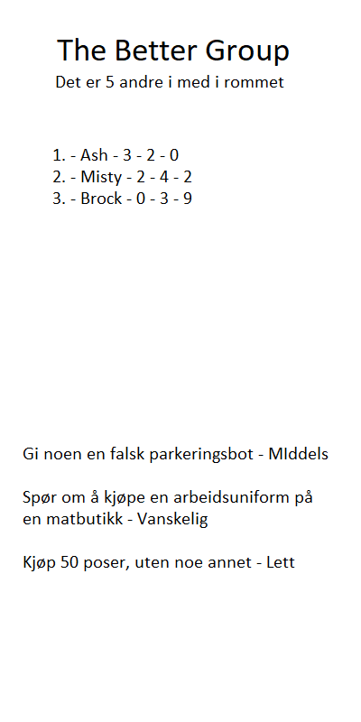
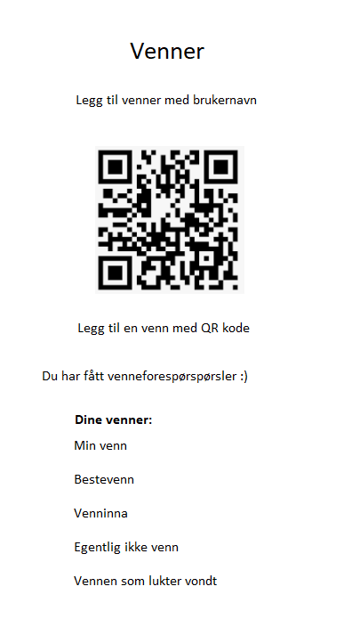
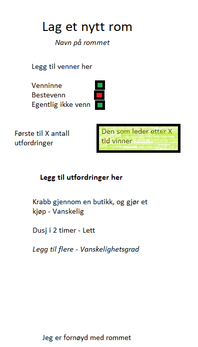
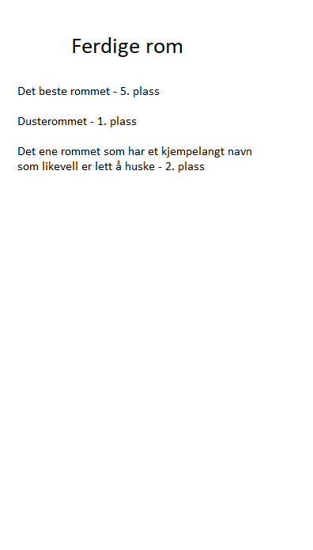

# Odsen

## Beskrivelse
Denne appen er ment for å grupper av folk, jeg ser for meg mellom 3 og 10 folk. Det vil fungere som et spill man spiller seg imellom. Tanken er at man lager "rom" med de man vil spille med. Deretter lager man utfordriger til hverande, som blir fordelt avhengig av modus man velger.

### Set mode
I denne modusen er tanken at man får et sett med utfordringer, og den som først fullfører alle vinner. Hvis man er 5 stykker, lager man da 4 utfordringer i stigende vanseklighetsgrad. Deretter blir det fordelt tilfeldig på de andre, så alle vil ende opp med 4 utfordringer. Dersom man vil ha flere utfordringer med en gang kan man lage flere serier med utfordringer.

### Loose mode
Her blir alle utfrodringene tilgjengelig for alle, og det er førsteman til mølla med å fulføre de. Dersom en har fullført en utfordring vil ikke de andre kunne fullføre den. I tillegg kan man ikke fullføre sine egne utforminger. Hver utfordring vil da han en score avhengig av hvor vanskelig den er. Den med høyest score vil da vinne når man er ferdig.

### Validering av utfordringer
For å få en utfordring godkjent kan man enten velge om man stoler på hverandre, altså at man ikke har noen form for validering. Dette passer best for utfordringer som påvirker noen i gruppa, så noen på den måten ser det.

Alternativt kan man ha en intern validering. Da kan man for eksempel tar bilde av at man har fullført en utfordring, eller en annen kan være med og se på utfordringen bli fullført. For eksempel å skrive noe med tusj i ansiktet og gå på butikken kan man ta bilde av, mens å løpe naken over en bruk kan man få noen med på å se på.

## Krav
For at appen skal kunne brukes så er det visse ting som må fungere, mens andre ting er mindre viktig. Siden ikke alle krav er like viktige er det derfor noen ting man må prioritere mer en andre. Derfor lager jeg 3 lister med krav ettersom hvor viktige de er.

### Må
Det er krav som må være på plass for at appen i det hele tatt skal fungere. Uten disse kravene vil appen ikke fungere. Jo flere av disse kravene som blir fullført, jo mer av appen vil fungere.

* Kommunikasjon med server / andre enheter
* Lage et rom
  * Gi tilgang til andre brukere til rommet
* Vise utfordringer som er i et rom man er med i selv
* Registrere en utfordring som fullført
* Se hvem andre som er med i et rom
* Se hvem som har fullført en utfordring

### Bør
Her er krevene som ikke er viktige for kjernefunksjonaliteten, men som tilbyr funksjonalitet likevell.

* Legge til utfordringer etter et rom er opprettet
* Se hvem som leder i et rom
* Kunne bytte mellom flere rom
* Avslutte et rom når man er ferdige
  * Se et rom som er avsluttet, både resultater og utfordringer
* Logge inn

### Kan
Kravene som er i denne kategorien er krav som ikke kommer til å bli prioritert i første omgang. Dette er fordi de ikke gir noen stor nytteverdi til appen.

* Mørkt tema istedenfor
* Verifisering av utfordringer
  * Laste opp bilder / filer for å dokumentere egne
  * Se andres bilder / filer for å godkjenne utfordring
* Logge inn på flere ulike enheter
* Legge til venner med QR kode
  

### Ikke-funksjonelle krav
I tillegg er det enkelte krav som ikke har noe med selve appen å gjøre. Disse kravene er viktige for at appen skal fungere, selv om de ikke er like direkte knyttet til appen som de andre kravene.
* Server med database

## Design
I utgangspunktet er appen tenkt å være i portrett modus. Grunnen til dette er at appen er tenkt til å brukes i korte intervaller. I tillegg bruker de fleste mobilen stående, så det blir derfor designet for flest mulig. Bildene som kommer under er tenkt til den "ferdige" applikasjonen, som støtter alle kravene.

Dette er forsiden man kommer til, dersom man er logget inn. Her får man vite hvem man er logget inn som, og 4 ulikebokser man bruker til å gå videre. I tillegg er det en mulighet til å logge av fra enheten.

Siden brukere må innom denne siden hver gang man skal inn på en av de andre sidene vil også dette fungere som en meny. Etter at man har gått inn på en av sidene kan man da komme tilbake hit ved tilbakeknappen man har på enheten sin.

Kommer hit etter å ha valgt et rom fra forsiden. Navnet på rommet kommer øverst, og så antallet i rommet. Antallet kan man klikke på for å se en liste med navnene. Deretter kommer en liste med de som leder i et rom, sammen med antall utfordringer vedkommende har fullført. Til slutt er det en liste over gjennværende utfordringer.

Siden har øverst en mulighet for å legge til andre brukere som venner, via brukernavn. I tillegg kommer en QR kode som kan brukes av noen andre for å kunne legge deg til som venn. Nederst er det en liste over alle vennene du har i appen.

I tillegg er det en linje der det står at man har fått venneforespørsler, dersom man har fått det. Da får man opp en oversikt over alle forespørsler man ikke har bekreftet/avvist i kronologisk rekkefølge.

Via denne skjermen kan man opprette nye rom. Fra øverst til nederst starter man med å velge navn på rommet. Deretter velger man hvem som skal være med i rommet, enten via søk eller via å krysse av fra en liste med de man spiller mest med. Etter det velger man når rommet avsluttes, markert med grønn boks. Man må i tillegg oppdatere "X" til enten et tall eller en dato.

Man må også legge til utfordringer til rommet, og sette en vanskelighetsgrad på dem. Brukeren legger da inn en tekst til å beskrive utfordringen, og velger mellom "Lett", "Middels" og "Vanskelig". Vanskelighetsgraden på utfordringer i en gruppe vil justere seg innad i gruppen etterhvert som deltakerne merker hva de synes er lett og vanskelig. Når man er ferdig har man en knapp til det nederst.

For alle tidligere fullførte rom er tanken at man skal kunne se hvor bra eller dårlig man har gjort det sammenlignet med de andre i rommet. Derfor har man en samleside for alle tidligere rom, der man kan scrolle gjennom en liste der navnet på rommet og din rangering står. Derfra kan man velge et for å se hvem som har gjort hvilke utfordringer, og den samlede resultatlista.

## Pros n cons

### Pros
Kan ta inn en del "android" ting, som push varsler for når noen fullfører en utfordring og Bluetooth for å finne andre i nærheten når man lager rom. I tillegg er det ikke programmatisk vanskelig, altså at det ikke er vanskelige algoritmer eller vanskelig matte.

### Cons
Kan bli litt for grunnleggende. Blir fort vekk bare å lytte etter oppdateringer fra en database/server, og så håndtere det i appen. I tillegg må man da ha en server, eller sette opp en virituell lokalt når man skal kjøre appen. Den må da i tilfellet settes opp og tyres med, selv om det ikke har alt for mye med apputvikling å gjøre.